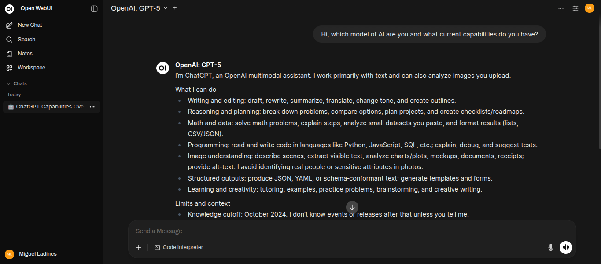
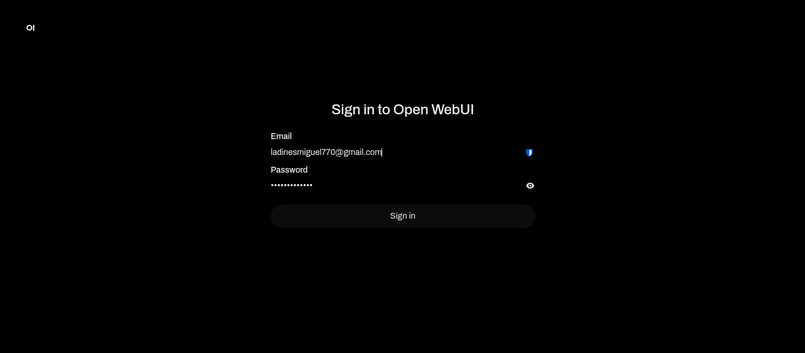
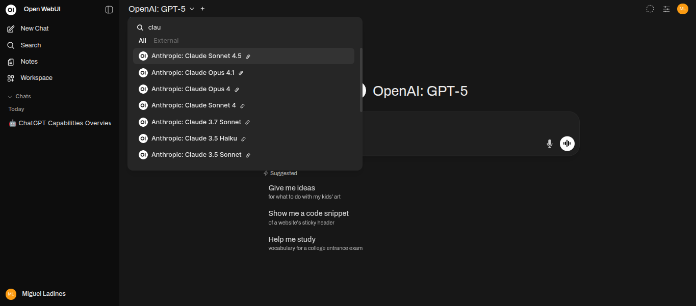
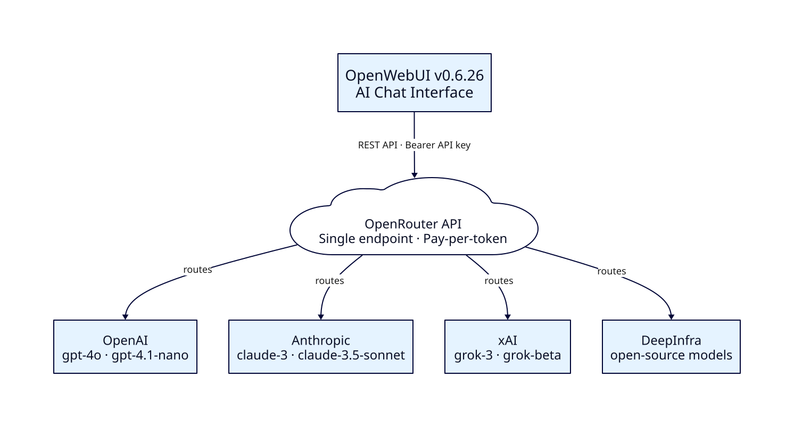
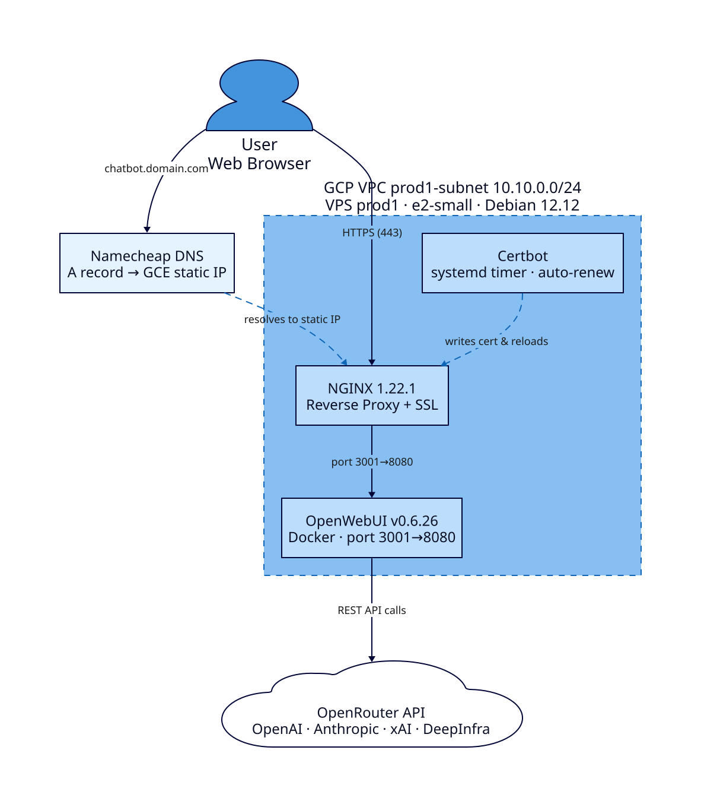
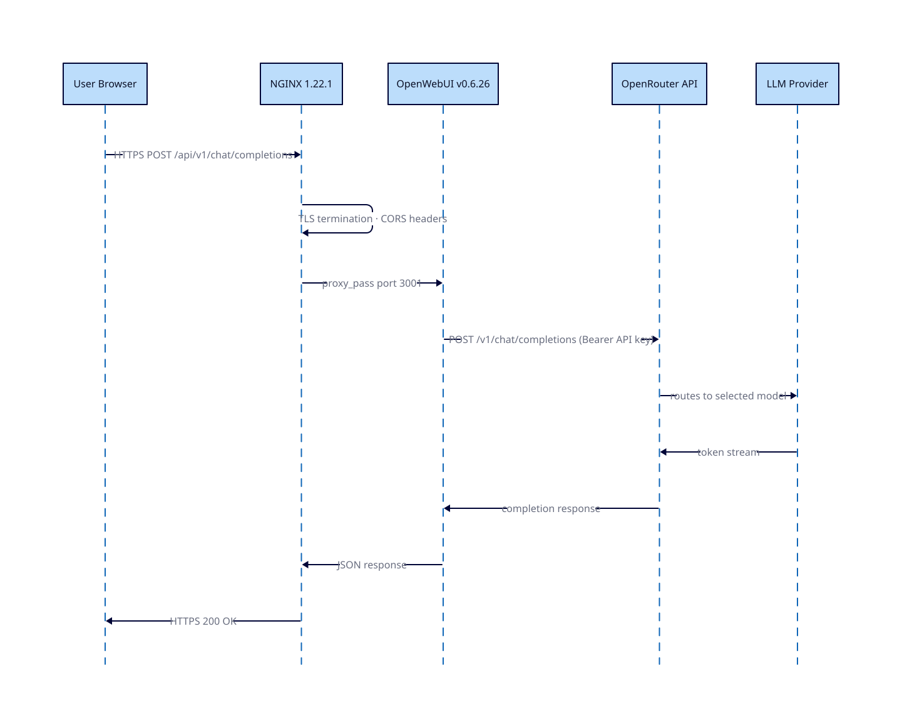
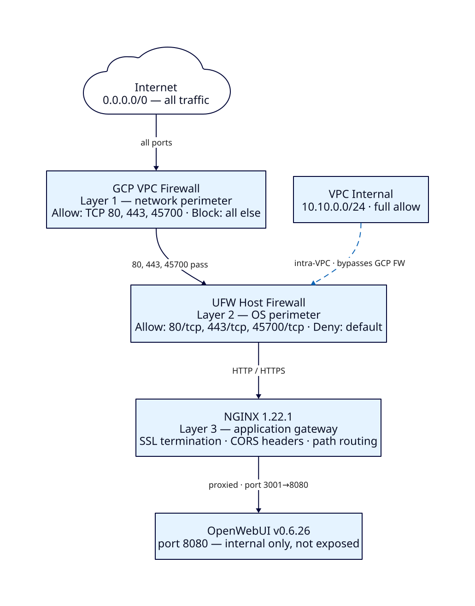

<h1 align="center">🤖 Self-Hosted Multi-Model AI Chatbot on Google Cloud</h1>

<p align="center"><em>A production-grade AI chatbot deployed on GCP — single Docker container behind NGINX, multi-provider LLM access via OpenRouter, from bare VM to live HTTPS endpoint.</em></p>

<p align="center">
  
  
  
  
  
  
  
  
</p>

---



## Table of Contents

1. [Overview](#1-overview)
   - [1.1 The problem](#11-the-problem)
   - [1.2 What it does](#12-what-it-does)
   - [1.3 Key features](#13-key-features)
2. [Walkthrough](#2-walkthrough)
3. [Architecture](#3-architecture)
   - [3.1 AI integration](#31-ai-integration)
   - [3.2 Components](#32-components)
   - [3.3 Request lifecycle](#33-request-lifecycle)
   - [3.4 Cloud infrastructure](#34-cloud-infrastructure)
   - [3.5 Network security](#35-network-security)
   - [3.6 Key decisions](#36-key-decisions)
4. [Tech stack](#4-tech-stack)
5. [Getting started](#5-getting-started)
   - [5.1 Prerequisites](#51-prerequisites)
   - [5.2 Installation](#52-installation)
   - [5.3 Configuration](#53-configuration)
   - [5.4 Run](#54-run)
6. [Testing](#6-testing)
7. [Author](#7-author)

## 1. Overview

### 1.1 The problem

Managing AI model access through commercial SaaS tools means fixed subscription costs, limited model choice, and no visibility over actual compute expenditure. A self-hosted solution removes those constraints — but wiring a containerized chat interface to a custom HTTPS domain requires coordinating cloud networking, reverse proxy configuration, SSL termination, and firewall rules as a coherent, stable system.

### 1.2 What it does

- Serves a private, HTTPS-accessible AI chat interface at a custom domain
- Routes all LLM calls through OpenRouter, giving access to OpenAI, Anthropic, xAI, and DeepInfra models from a single UI
- Operates on a pay-per-token model with no fixed subscription — usage and cost are visible in real time
- Runs as a single Docker container behind NGINX on a GCE Debian 12 VM, validated over ~5 weeks of uninterrupted operation

### 1.3 Key features

- Multi-provider LLM access — OpenAI, Anthropic (Claude), xAI (Grok), and DeepInfra models selectable from the interface
- HTTPS with automatic certificate renewal via Let's Encrypt / Certbot
- NGINX handles WebSocket upgrades, CORS headers, and path-specific routing for `/`, `/api/`, and `/ws/`
- VPC-isolated deployment with UFW and GCP firewall rules — only ports 80 and 443 are publicly exposed
- API key managed in the OpenWebUI Admin panel — no secrets in config files or environment variables
- Total running cost: ~$15 USD/month (VPS) + pay-per-token API usage with configurable spending caps

## 2. Walkthrough

Screenshots from the running system, accessible over HTTPS at a custom domain.






## 3. Architecture

### 3.1 AI integration

The system uses OpenRouter as the single gateway to multiple LLM providers. OpenWebUI sends one authenticated REST call; OpenRouter routes it to whichever model is selected in the UI.



### 3.2 Components



- **Namecheap DNS** — A record maps the custom domain to the GCE static external IP
- **NGINX 1.22.1** — reverse proxy: SSL termination, WebSocket upgrade headers (`Connection: upgrade`), CORS response headers, routes `/`, `/api/`, and `/ws/` to the container on port 3001
- **OpenWebUI v0.6.26** — containerized chat UI running in Docker; host port 3001 maps to container port 8080
- **Certbot** — systemd timer process that renews the Let's Encrypt certificate and reloads NGINX in place; not a persistent service
- **OpenRouter API** — external multi-LLM gateway; receives authenticated REST requests from OpenWebUI and routes them to the selected provider

### 3.3 Request lifecycle

A single chat message travels through five hops before the model response returns to the browser.



### 3.4 Cloud infrastructure

| Property | Value |
|----------|-------|
| Provider | Google Cloud Platform — Compute Engine |
| VPC | `webhosting` (custom) |
| Subnet | `prod1-subnet` — us-east1, 10.10.0.0/24 |
| Instance | `prod1` — e2-small (2 vCPU, 2 GB RAM), Debian 12.12 Bookworm |
| Storage | 20 GB Persistent SSD, UEFI-compatible |
| External IP | Static, bound to domain A record via Namecheap DNS |
| Shielded VM | Enabled — Secure Boot, vTPM, Integrity Monitoring |
| Auto-restart | Enabled |
| Firewall (host) | UFW: 80, 443, 45700/tcp |
| Firewall (network) | GCP VPC: ICMP, TCP 22/80/443/45700 from `0.0.0.0/0`; full allow on `10.10.0.0/24` |

### 3.5 Network security

Traffic passes through two independent firewall layers before reaching the application. The container port (8080) is never exposed externally — only NGINX accepts public connections.



### 3.6 Key decisions

| Decision | Chosen | Discarded | Reason |
|----------|--------|-----------|--------|
| AI gateway | OpenRouter API | Local Ollama server | No GPU cost; pay-per-token transparency; single API key for multiple providers |
| Containerization | Docker (single container) | VM-native install | Reproducible deployment; official image; automatic restart on crash |
| SSL | Let's Encrypt / Certbot | Self-signed certificate | Browser-trusted; auto-renews; zero cost |
| Reverse proxy | NGINX | Direct container port exposure | Required for WebSocket upgrades, CORS headers, HTTPS redirect, and `/api/` isolation |
| VM size | e2-small (2 vCPU, 2 GB RAM) | Larger instances | OpenWebUI is UI-only; all model inference runs on OpenRouter — minimal local resources needed |
| SSH hardening | Custom port 45700 | Default port 22 | Reduces automated brute-force noise at the network edge |

## 4. Tech stack

| Layer | Technology | Why this over alternatives |
|-------|-----------|---------------------------|
| Cloud platform | Google Cloud Compute Engine | Predictable pricing; static IP support; Shielded VM features |
| Operating system | Debian 12.12 (Bookworm) | Stable LTS; minimal footprint; first-class Docker and NGINX support |
| Reverse proxy | NGINX 1.22.1 | Industry standard; native WebSocket support; tight Certbot integration |
| Containerization | Docker 28.4.0 | OpenWebUI ships as a Docker image; portable; restarts automatically |
| Chat interface | OpenWebUI v0.6.26 | Open-source; built-in OpenRouter/custom API support; no-code model switching |
| AI gateway | OpenRouter API | Single integration point for 100+ LLM providers; usage-based billing with spending caps |
| LLM providers | OpenAI, Anthropic, xAI, DeepInfra | Diverse capability-to-cost ratio; all accessible via one API key through OpenRouter |
| Host firewall | UFW 0.36.2 + GCP VPC rules | Defense in depth: host-level and network-level rules independently enforced |
| SSL / TLS | Let's Encrypt (Certbot) | Automated renewal; universally browser-trusted; free |
| DNS / Domain | Namecheap | Low-cost domain registration; A and CNAME records with short TTL |

## 5. Getting started

### 5.1 Prerequisites

| Requirement | Details |
|-------------|---------|
| GCP account | Compute Engine API enabled; billing configured |
| VM | Debian 12+, e2-small (2 vCPU, 2 GB RAM minimum) with a reserved static external IP |
| Domain | A record pointing `chatbot.yourdomain.com` to the static IP |
| Docker CE | 28.x — install from the official Docker apt repository |
| NGINX | 1.22+ — available via `apt` |
| Certbot | `certbot` + `python3-certbot-nginx` — available via `apt` |

### 5.2 Installation

```bash
# Update base system
sudo apt update && sudo apt upgrade -y

# Install all required packages in one pass
sudo apt install -y \
  git curl build-essential lsof tree \
  docker-ce docker-ce-cli containerd.io \
  docker-buildx-plugin docker-compose-plugin \
  nginx certbot python3-certbot-nginx \
  ufw apache2-utils

# Configure host firewall
sudo ufw allow 80,443/tcp
sudo ufw allow 45700/tcp    # custom SSH port
sudo ufw enable
sudo ufw status
```

### 5.3 Configuration

| Parameter | Value | Where to set |
|-----------|-------|--------------|
| OpenRouter API key | Token from [openrouter.ai/keys](https://openrouter.ai/keys) | OpenWebUI Admin panel → Connections |
| OpenRouter base URL | `https://openrouter.ai/api/v1` | OpenWebUI Admin panel → Connections |
| Container host port | `3001` (maps to container `8080`) | `docker run -p 3001:8080 ...` |
| Domain name | `chatbot.yourdomain.com` | NGINX site config + Certbot `-d` flag |
| SSH port | `45700` (recommended) | `/etc/ssh/sshd_config` + UFW rule |
| Spending cap | Recommended $10 for initial testing | OpenRouter Billing panel |

NGINX site configuration lives at `/etc/nginx/sites-available/chatbot.conf`. It must include WebSocket upgrade headers (`Upgrade`, `Connection`), CORS response headers, and path-specific proxy rules for `/`, `/api/`, and `/ws/`.

### 5.4 Run

```bash
# Start OpenWebUI
docker run -d \
  -p 3001:8080 \
  --name open-webui \
  --restart always \
  ghcr.io/open-webui/open-webui:main

# Enable NGINX site and reload
sudo ln -s /etc/nginx/sites-available/chatbot.conf /etc/nginx/sites-enabled/
sudo nginx -t && sudo systemctl reload nginx

# Issue TLS certificate
sudo certbot --nginx \
  -d chatbot.yourdomain.com \
  -d www.chatbot.yourdomain.com
```

After Certbot completes, the chatbot is reachable at `https://chatbot.yourdomain.com`. On first access, create the admin account and add the OpenRouter API key under Admin → Connections.

## 6. Testing

Validation is performed via `curl` against the OpenWebUI chat completions endpoint. Both the internal server-side path and the public HTTPS endpoint are verified.

**Internal — from the VPS:**

```bash
curl http://127.0.0.1:3001/api/v1/chat/completions \
  -H "Content-Type: application/json" \
  -H "Authorization: Bearer <OPENWEBUI_API_KEY>" \
  -d '{
    "model": "openai/gpt-4.1-nano",
    "messages": [{ "role": "user", "content": "Hello, which model are you?" }]
  }'
```

**External — from the internet over HTTPS:**

```bash
curl https://chatbot.yourdomain.com/api/v1/chat/completions \
  -H "Content-Type: application/json" \
  -H "Authorization: Bearer <OPENWEBUI_API_KEY>" \
  -d '{
    "model": "openai/gpt-4.1-nano",
    "messages": [{ "role": "user", "content": "Hello, which model are you?" }]
  }'
```

Both calls return a valid JSON completion from the model, confirming end-to-end routing through NGINX → OpenWebUI → OpenRouter. The external call additionally validates SSL termination and correct CORS headers.

## 7. Author

**Miguel Ladines** · [@dev-mikel](https://github.com/dev-mikel)  
Electronics Engineer · AI Developer | Automation & Systems Integration
